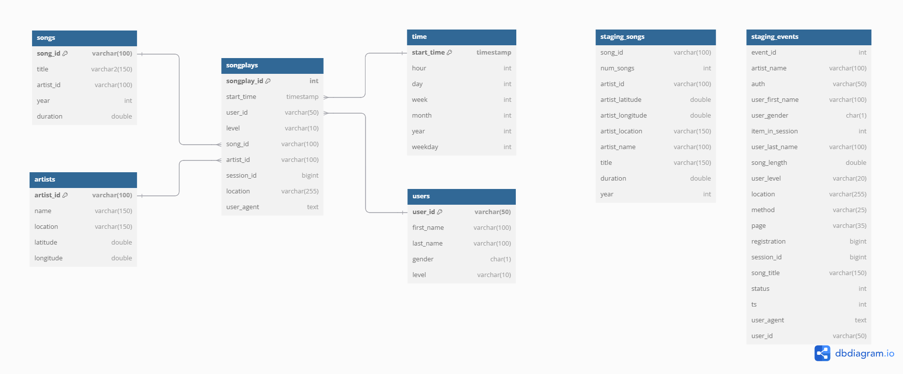

# Project 3: Cloud Data Warehouse on AWS

## Introduction

In this project we implement a cloud data warehouse on AWS for a music streaming startup Sparkify by building an ETL pipeline that extracts company's data from **AWS S3** storage area into staging tables on **Redshift** and then loads the data into a set of tables optimized for analysis.

## Datasets

There are two primary datasets used in this project - songs data and log files.  The song data is a subset of the song dataset from the Million Song Data, which contains information on artists and songs played.  The log files contain information on music streaming events partitioned by months and year.

## Database Schema

The tables in the data warehouse are organized around a star schema, which consists of a fact table and a set of dimension tables.  Below is a graphical representation of the schema used in this project.

## Data Warehouse Setup

To set the the data warehouse, we are utilizing infrastructure as code (IaC) to automate the process of create clients for IAM, EC2, S3 and Redshift, setting up the ETL pipeline.  After the data warehouse setup, resources are cleaned programmatically as well.

## ETL Pipeline

The ETL pipeline consists of copying data from S3 bucket into two staging tables, one for temporarily staging events data and the other for staging the songs data, and then using those tables to populate the fact and dimension tables.

## How to Run

Use the following steps to set up the Redshift cluster, create and populate the data warehouse with AWS Redshift:

1. Create a new IAM user in our AWS account Give it AdministratorAccess from existing policies. Copy the access key and secret Add to the the dwh.cfg file, the following:

    [AWS]

    KEY= YOUR_AWS_KEY

    SECRET= YOUR_AWS_SECRET

2. Run the the AWS SDK create_redshift_cluster.ipynb jupyter notebook.  This will create AWS clients for EC2, S3, IAM and Redshift.  You will also be able to test the connectivity to the S3 bucket and create a Redshift cluster.

3. Get the value of endpoint and role for put into main configuration file dwh.cfg under "ARN".

4. Authorize security access group to Default TCP/IP Address. Launch database connectivity configuration

5. Run "python create_tables.py" using %run magic function within the jupyter notebook cell.

7. Run "etl.py"
   
9. Run select queries to make sure records were inserted correctly during the ETL process.
    
11. Clean up resources on AWS to preserve cost

